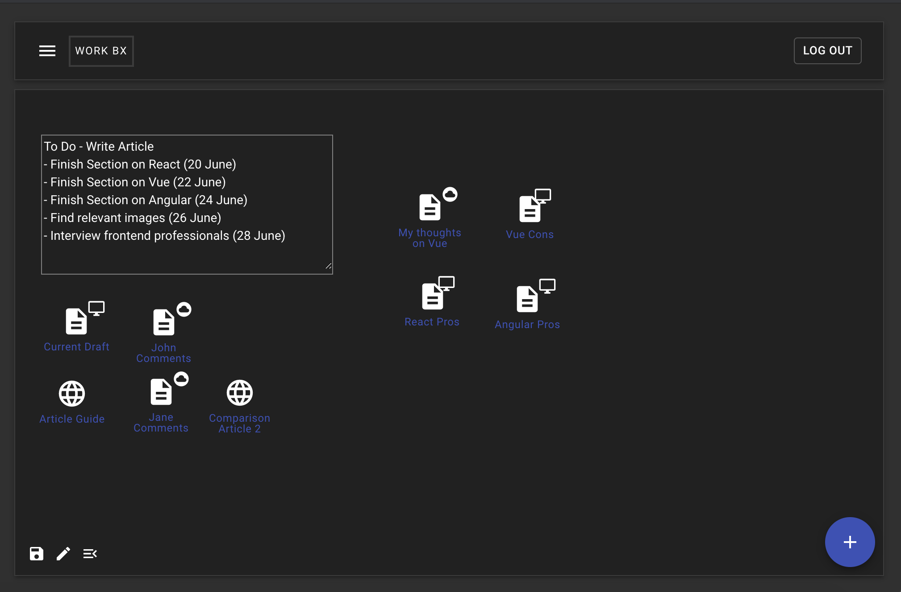
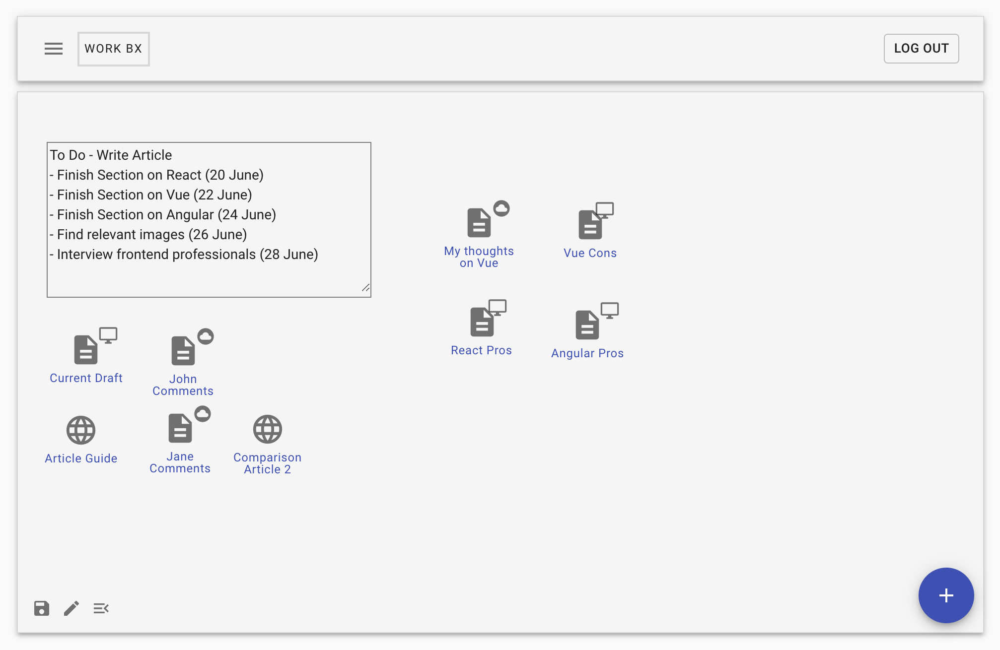
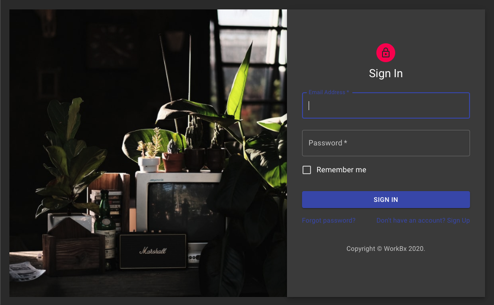
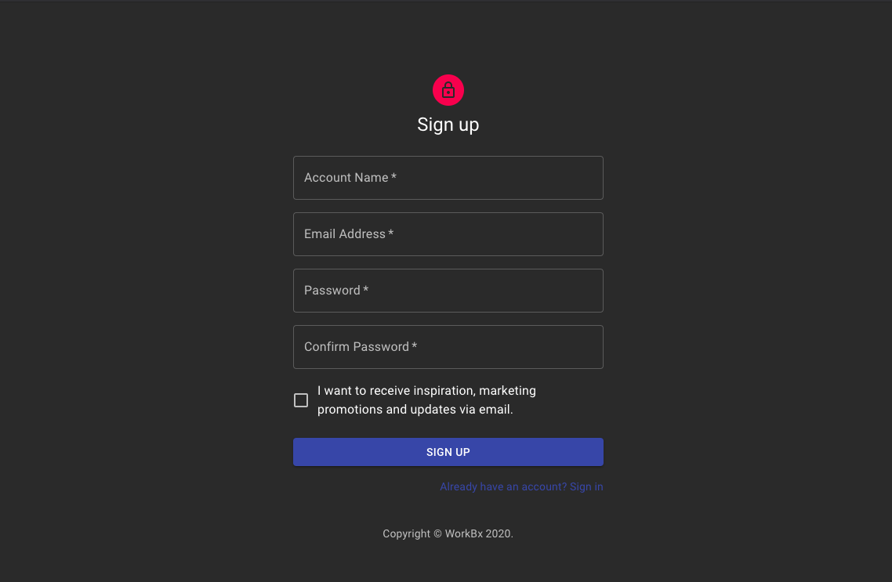

# WorkBx - Put all the stuff you need in one place 

Demo - https://workbx.herokuapp.com/

Please forgive the silly name.

This was a webapp designed to solve a common problem I faced - Whenever I started on a new project, I typically would have my resources all over the place (e.g. 10 links, 3 random files in different clouds, a sticky note on my desktop, etc.). Furthermore, current project management tools or note taking apps (e.g. Trello, Evernote) didn't have suitable UIs. Evernote for instance, focused too much on a document style format that felt less suited for my needs, particularly when it came to linking files and websites.

## Technologies
- React (v16)
- Node / Express.js (v4) as production and development server
- Postgres SQL - for database server
- Webpack 4 (production and development configurations)
- SCSS support (+ sanitize.css included)
- ES2015+
- Key Libraries - Material UI, React Draggable

## Features
- Current version supports linking local files, weblink files, cloud storage files, and generating sticky notes 
- Note: local links require installation of this chrome extension - [Enable Local Links](https://chrome.google.com/webstore/detail/enable-local-file-links/nikfmfgobenbhmocjaaboihbeocackld?hl=en)
- Note: Clicking on local link to microsoft word document will re-download the document
- Future features for development
    - Tagging the different elements
    - Ability to create multiple 'boxes' to run more than one project at the same time (Dashboard interface)
    - Ability to share 'read only' access to box

## License
MIT License. Free use and change.
